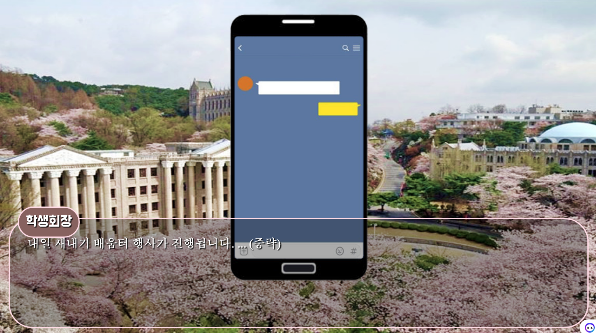

# 브라우저 미연시 게임: 두근두근 대학생활 시뮬레이션

### [PlayLink](https://developdh.github.io/HowToMeaLWithNayeon/main)

OKIS 글로벌 멘토링 B조 수업을 위한 시뮬레이션입니다.

---

- [HowToMeaLWithNayeon](https://github.com/developdh/HowToMeaLWithNayeon.git)을 Fork하여 만든 시뮬레이션입니다.
- 호감도 기능이 추가되었습니다.
- 순수 브라우저 HTML, JS, CSS로만 구현된 브라우저 미연시 게임 엔진 및 게임입니다.
- 빌더를 이용한 스크립트 작성으로 시나리오를 구성할 수 있습니다.

